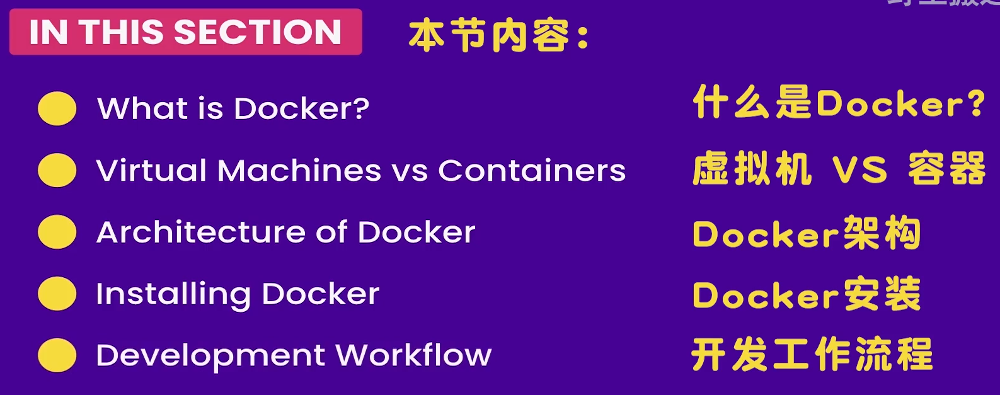
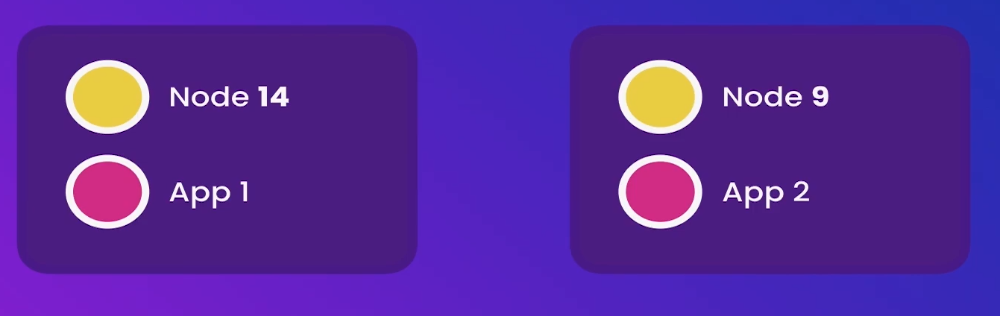

# Docker概述



## Docker 是什么

Docker 是一个以稳定方式搭建, 安装, 运行应用的平台.
他可以以相同的方式在其他机器上运行

> 个人理解: docker 是一个隔离沙箱

> Docker 是一个应用打包、分发、部署的工具.
  你也可以把它理解为一个轻量的虚拟机，它只虚拟你软件需要的运行环境，多余的一点都不要.
>
> 而普通虚拟机则是一个完整而庞大的系统，包含各种不管你要不要的软件。
>
> 来源 [Docker 简介和安装](https://docker.easydoc.net/doc/81170005/cCewZWoN/lTKfePfP)

## 为什么使用 Docker

### 原因

有时我们做好的软件, 可是到了别人的电脑上就运行失败了.

一般有以下 3 个原因:

1. 部署时缺失了某些文件, 导致应用没有完全部署
2. 计算机运行的版本与应用要求版本不匹配, 比如软件依赖 node.js v14 版本, 可是电脑上只有 v6 版本
3. 不同电脑环境不同


### 使用 docker 好处

#### 好处1

而 Docker 可以将应用与应用程序依赖的全部**打包**到一起.
如此, 应用便可在所有地方运行
> [!TIP]
>
> 比如新人加入团体, 也没必要浪费半天配置新电脑环境.
> 只需要告诉 docker 调用打包好的程序(`docker-compose up`), docker 就会自动下载这些

#### 好处2

隔离的环境允许运行多个应用程序**同时使用**不同的软件版本



#### 好处3

做多个项目时, 有可能需要多个环境, 不同的应用牵扯了太多的库和工具.
长久以往, 我们的机器将会变得混乱不堪, 我们会根本**无从判断哪些工具是可以删除的**. 会担心弄乱某个程序.

只需要运行以下命令即可清理

```powershell
docker-compose down --rmi all
```
