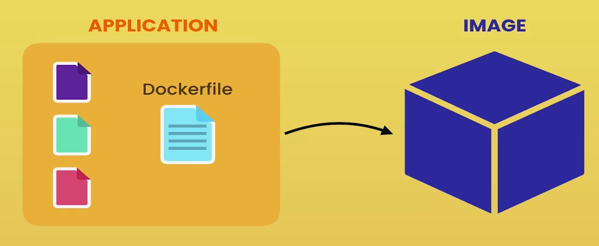
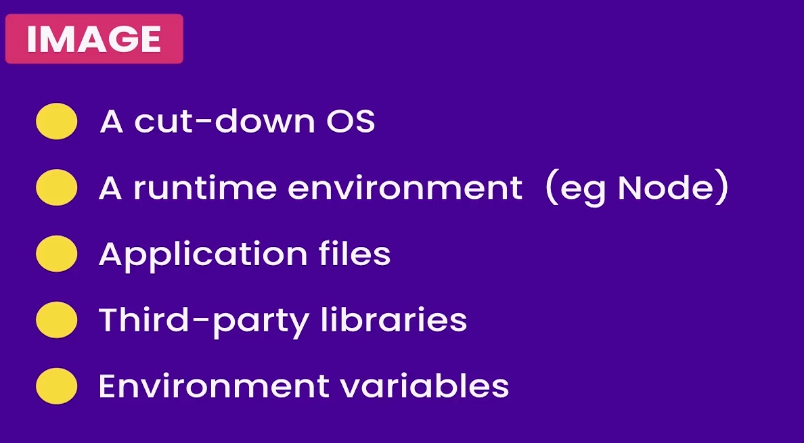

# docker 开发流程

## docker化(dockerize)

首先, 要有一个应用程序. 然后, 再往应用程序里面添加一个 **Dockerfile** 文件

Dockerfile 是一个纯文本文件, 其包含了 docker 用什么方式来将程序**打包**为 **Image**

这个 Image 包含了我们应用程序的所有依赖

## Image

### Image的内容

1. 精简的操作系统
2. 程序运行环境(eg. node, dotnet版本)
3. 应用程序文件
4. 第三方库(eg. 程序需要第三方的中间件, redis之类的)
5. 环境变量

### Image的作用

有了 Image, 就可以让 docker 使用该 Image 启动一个 Container.
所以前面才说容器是一个特殊的进程. 因为其有着自己的文件系统, 由 Image 提供

最后, 应用程序被加载到容器, 这就是 docker 运行应用程序的方式.

一旦有了此 Image(映像)，我们就可以将其推送到Docker注册表(如 docker hub)

docker到docker的枢纽就像git的github一样，它是docker映像的存储空间.
即: 我们可以开放自己做好的 Image 给所有人部署.
