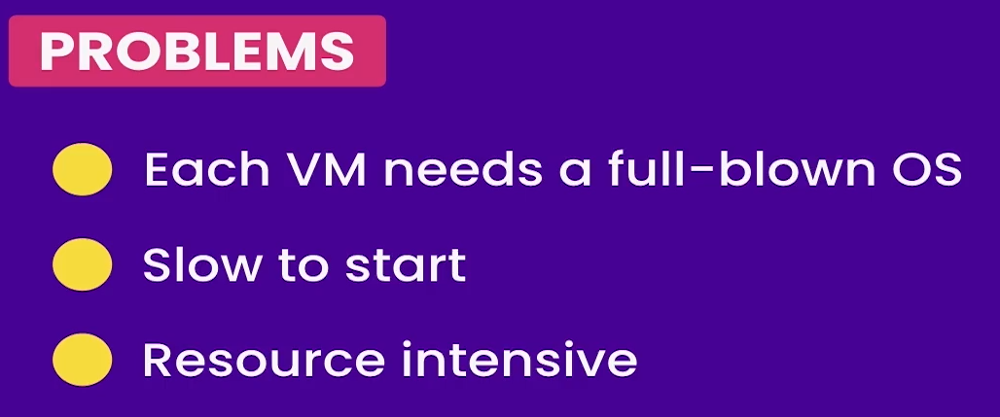
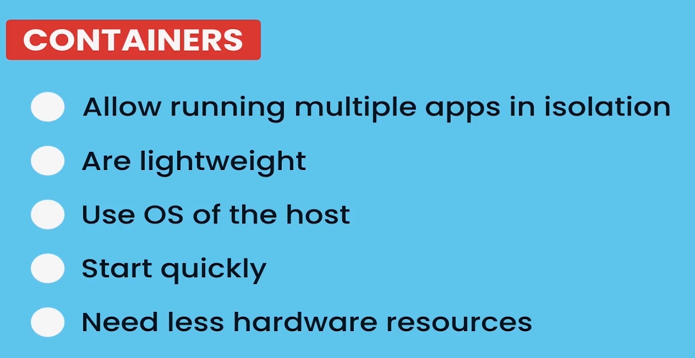

# 虚拟机和容器(Container)的区别

## 虚拟机

虚拟机是一个虚拟化的完整的机器, 是一整个完整的系统

劣势:

1. 虚拟机需要操作系统副本. 需要获取操作系统许可, 修补, 检查.
2. 启动缓慢.其必须像启动机器一般加载整个系统, 这也是为什么虚拟机启动较慢.
3. 虚拟机需要大量资源. 因为每个虚拟机需要占用一部分的硬件资源, 如: CPU, 内存, 磁盘等.
   由于内存是有限的, 所以**一台机器能开的虚拟机也是有限的**.

## 容器 Container

Container 是用来运行应用程序的隔离环境

优势:

1. 运行多个隔离的应用程序. 容器为我们提供了相同的隔离度，因此我们可以运行多个隔离的应用程序.
2. 更加轻便, 体积较小.
3. 启动快速. 操作系统中已经启动过的容器可以很快启动.
4. 不需要占用主机的一部分资源. 因此不需要为 Container 设置特定的 CPU 核心或其他资源.
   所以, 我们**可以同时运行数十或更多的容器**.
5. 所有容器由同一个操作系统进行托管
    > (注: 原文 3. Use OS of the host)
    >
    > 在这里是根据vs2022 的翻译方式, 所以认为 host 是托管的意思

