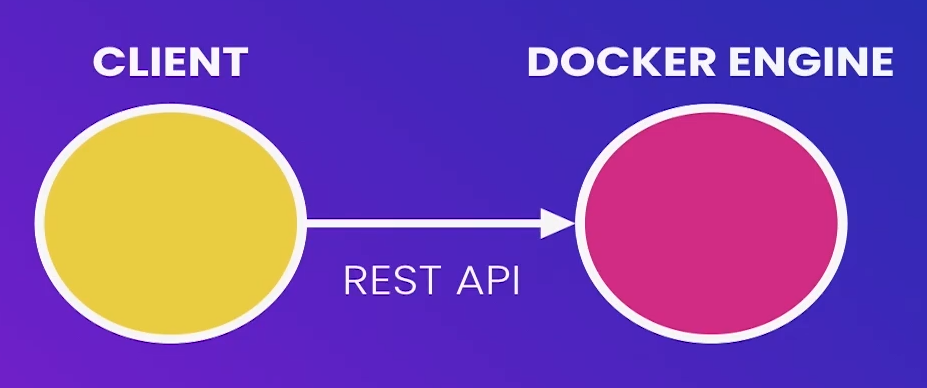
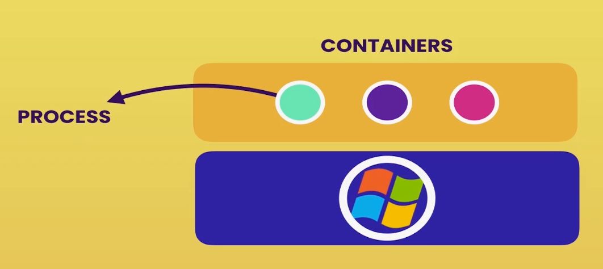
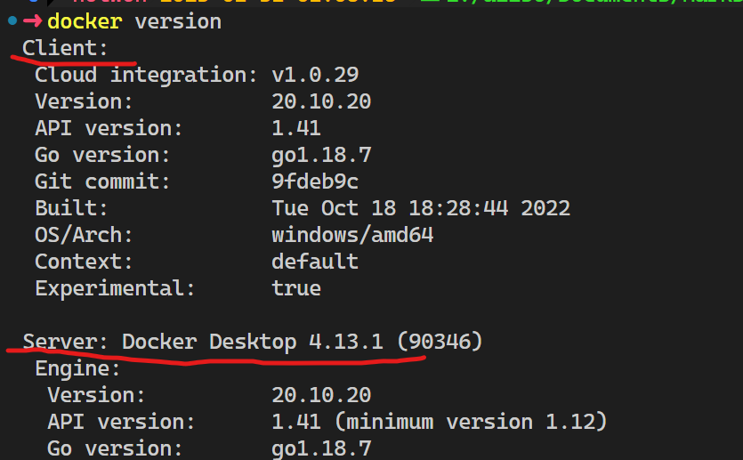

# docker 体系结构(Architecture)

docker 使用的是 CS 模式, 通过 Restful API 到服务器

而 Server(也被称为 docker 引擎) 则位于后台, 负责构建和运行 docker 容器

## 从技术上讲

Container 只是一个进程(Process), 不过这是个特殊的进程.

> [!WARNING]
>
> Container 不包含完整的操作系统.

主机上的所有容器共享主机的操作系统. 准确的说, 这些**容器共享主机的内核(kernel)**

## 安装

docker 安装完毕后运行 `docker version` 会出现以下界面

> [!TIP]
>
> 如果 Server 没有出现, 则代表着没有启动 docker 引擎

